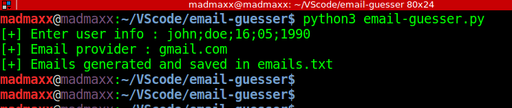

# Email-guesser

* **Description** : This tool permutes all the most likely combinations of ones email-id, provided some personal details like name and date of birth.

* **Installation** : Simply clone this repository and run the python script using the command "python3 email-guesser.py"

* **Usage** : Give details of the person as shown in the image.

* **How to actually find the email-id** : Find a service which you know the victim has already signed up on. Sign up on the same platform with fake creds and send the request through burp proxy. In burp, send the sign up request to intruder. Set the emial parameter as payload location and use the output of this tool (emails.txt) as custom payload. Start the attack. If you could guess all the terms in the email-id correctly, you will get one response saying the email-id has been already registered with the website or something similar to that. Set the response in grep-match option under intruder.
